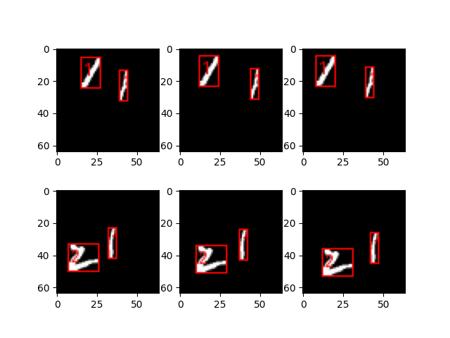

# Moving MNIST with Annotations
This repository provides a MovingMNIST class to load the Moving MNIST with annotations dataset, which contains sequences of MNIST digits moving within a frame. It is based on PyTorch's VisionDataset and allows easy access to both the sequences and their annotations. The class also provides a utility to download the dataset from a specified mirror.


    
    
## Installation
To use this code, you will need to have the following dependencies installed:
* Python 3.6+
* PyTorch
* NumPy
* urllib

You can install the required packages using pip:

```bash
pip3 install -r requirements.txt
```
    
    
## Usage
You can use the MovingMNIST class to load the dataset and access the sequences and annotations. The dataset can be downloaded automatically by passing the download=True argument during initialization.
    
### Loading the Dataset
```python
from moving_mnist import MovingMNIST

# Initialize the dataset, downloading if necessary
dataset = MovingMNIST(root='path/to/dataset', download=True)

# Access the length of the dataset
print(f"Number of sequences: {len(dataset)}")

# Access a specific sequence and its corresponding annotation
sequence, annotation = dataset[0]
```
    

## Dataset Details
The Moving MNIST dataset contains sequences of MNIST digits moving within a 64x64 frame. Each sequence has 20 frames, and the corresponding annotations provide bounding boxes and labels for the moving digits.

1. **Sequences**: Each sequence consists of 20 frames, with each frame being 64x64 pixels. The data format is:
    * ```[sequence, frame, channel, height, width]```
        * ```sequence```: Number of sequences in the dataset.
        * ```frame```: Number of frames per sequence (20 frames).
        * ```channel```: Number of channels in the image (for grayscale images, this is 1).
        * ```height```: Height of each frame (64 pixels).
        * ```width```: Width of each frame (64 pixels).

2. **Annotations**: The annotations include bounding boxes and class labels for each sequence. The format is:
    * ```[sequence, frame, boxes]```
        * ```boxes```: List of bounding boxes for the digits in a given frame.
        * Each ```box``` is represented as: ```[class_id, xmin, ymin, xmax, ymax]```
            * ```class_id```: The label of the digit (0-9).
            * ```xmin, ymin```: The top-left corner of the bounding box.
            * ```xmax, ymax```: The bottom-right corner of the bounding box.


## License
This repository uses the MIT license.